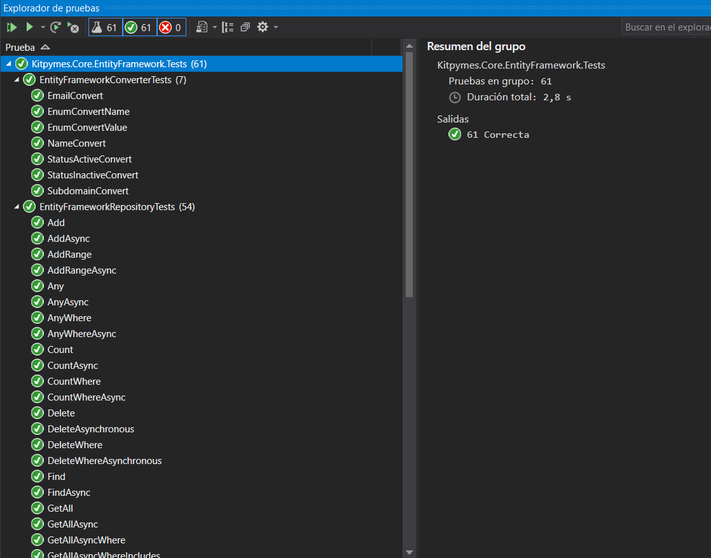

#  Kitpymes.Core.EntityFramework

**Librería para utilizar Entity Framework para el acceso a datos**

[](https://github.com/kitpymes/template-netcore-entityframework/actions)
[](https://www.nuget.org/packages/Kitpymes.Core.EntityFramework/)
[](https://www.nuget.org/stats/packages/Kitpymes.Core.EntityFramework?groupby=Version)
[](https://github.com/kitpymes/template-netcore-entityframework/blob/master/docs/LICENSE.txt)
[](https://github.com/kitpymes/template-netcore-entityframework/)
[](https://github.com/kitpymes/template-netcore-entityframework/)

## 📋 Requerimientos 

* Visual Studio >= 2019

* NET TargetFramework >= net5.0

* Net Core SDK >= 5.0.100

* C# >= 9.0

* Conocimientos sobre Inyección de Dependencias

## 🔧 Instalación 

_Se puede instalar usando el administrador de paquetes Nuget o CLI dotnet._

_Nuget_

```
Install-Package Kitpymes.Core.EntityFramework
```

_CLI dotnet_

```
dotnet add package Kitpymes.Core.EntityFramework
```

## ⌨️ Código

### Extensions

```cs
public static class ConfigurationsExtensions
{
    public static ModelBuilder WithEntitiesConfigurations(this ModelBuilder modelBuilder, Assembly assembly, bool enabled = true) {}
}
```

```cs
public static class DetectChangesLazyLoadingExtensions
{
    public static DbContext WithDetectChangesLazyLoading(this DbContext context, bool enabled = true) {}
}
```

```cs
public static class EntityFrameworkServiceCollectionExtensions
{
   public static TDbContext LoadSqlServer<TDbContext, TUnitOfWork>(
        this IServiceCollection services,
        Action<SqlServerOptions> sqlServerOptions)
            where TDbContext : EntityFrameworkContext
            where TUnitOfWork : EntityFrameworkUnitOfWork<TDbContext>
    {}

    public static TDbContext LoadSqlServer<TDbContext, TUnitOfWork>(
        this IServiceCollection services,
        SqlServerSettings sqlServerSettings)
            where TDbContext : EntityFrameworkContext
            where TUnitOfWork : EntityFrameworkUnitOfWork<TDbContext>
    {}

    public static TDbContext LoadInMemoryDatabase<TDbContext>(
        this IServiceCollection services,
        Action<InMemoryDbContextOptionsBuilder>? inMemoryDbContextOptions = null,
        string? databaseName = null)
            where TDbContext : EntityFrameworkContext
    {}

    public static TDbContext LoadContext<TDbContext>(
        this IServiceCollection services,
        Action<EntityFrameworkOptions> entityFrameworkOptions)
            where TDbContext : DbContext
    {}

    public static TDbContext LoadContext<TDbContext, TUnitOfWork>(
        this IServiceCollection services,
        Action<EntityFrameworkOptions> entityFrameworkOptions)
            where TDbContext : DbContext
            where TUnitOfWork : EntityFrameworkUnitOfWork<TDbContext>
    {}

    public static TDbContext LoadContext<TDbContext>(
        this IServiceCollection services,
        EntityFrameworkSettings entityFrameworkSettings)
            where TDbContext : DbContext
    {}

    public static TDbContext LoadContext<TDbContext, TUnitOfWork>(
        this IServiceCollection services,
        EntityFrameworkSettings entityFrameworkSettings)
            where TDbContext : DbContext
            where TUnitOfWork : EntityFrameworkUnitOfWork<TDbContext>
    {}
}
```

```cs
public static class GlobalFiltersExtensions
{
    public static ModelBuilder WithTenantFilter(this ModelBuilder modelBuilder) {}

    public static void WithFilter<TInterface>(this ModelBuilder modelBuilder, Expression<Func<TInterface, bool>> expression) {}
}
```

```cs
public static class QueryableExtensions
{
    public static IQueryable<T> ToQueryable<T>(this DbContext context)
        where T : class
    {}

    public static IQueryable<T> ToInclude<T>(this IQueryable<T> queryable, Expression<Func<T, object>>[] includes)
        where T : class
    {}
}
```

```cs
public static class ShadowPropertiesExtensions
{
    public static ModelBuilder WithShadowProperties(this ModelBuilder modelBuilder) {}
}
```


### Helpers

```cs
public abstract class EntityFrameworkConverter
{
    public static ValueConverter<TEnum, string> ToEnumName<TEnum, TValue>() {}

    public static ValueConverter<TEnum, TValue> ToEnumValue<TEnum, TValue>() {}

    public static ValueConverter<StatusEnum, string> ToStatus() {}

    public static ValueConverter<Email, string> ToEmail<TEnum>() {}

    public static ValueConverter<Name, string> ToName<TEnum>() {}

    public static ValueConverter<Subdomain, string> ToSubdomain<TEnum>() {}
}
```

### Settings

```cs
public class EntityFrameworkOptions
{
    public EntityFrameworkSettings EntityFrameworkSettings { get; private set; } = new EntityFrameworkSettings();

    public EntityFrameworkOptions WithDbContextOptions(Action<DbContextOptionsBuilder> dbContextOptionsBuilder) {}

    public EntityFrameworkOptions WithEnsuredCreated(bool enabled = true) {}

    public EntityFrameworkOptions WithMigrateEnabled(bool enabled = true) {}

    public EntityFrameworkOptions WithEnsuredDeleted(bool enabled = true) {}
}
```

```cs
public class EntityFrameworkSettings
{
    public Action<DbContextOptionsBuilder>? DbContextOptionsBuilder { get; set; }

    public bool? IsEnsuredCreatedEnabled { get; set; } = false;

    public bool? IsEnsuredDeletedEnabled { get; set; } = false;

    public bool? IsMigrateEnabled { get; set; } = false;
}
```

```cs
public class SqlServerOptions : EntityFrameworkOptions
{
    public SqlServerSettings SqlServerSettings { get; private set; } = new SqlServerSettings();

    public SqlServerOptions WithDbContextOptions(Action<SqlServerDbContextOptionsBuilder> sqlServerDbContextOptions) {}

    public SqlServerOptions WithLogErrors(bool enabled = true) {}

    public SqlServerOptions WithConnectionString(string connectionString) {}
}
```

```cs
public class SqlServerSettings : EntityFrameworkSettings
{
    public Action<SqlServerDbContextOptionsBuilder>? SqlServerDbContextOptions { get; set; }

    public bool? IsLogErrorsEnabled { get; set; } = false;

    public string? ConnectionString { get; set; }
}
```

### UnitOfWork

```cs
public interface IEntityFrameworkUnitOfWork : IEntityFrameworkDbContext
{
}
```

```cs
public abstract class EntityFrameworkUnitOfWork<TDbContext> : IEntityFrameworkUnitOfWork
    where TDbContext : DbContext
{
    public EntityFrameworkUnitOfWork(TDbContext context) {}

    public IDbContextTransaction Transaction { get; }

    public virtual void OpenTransaction(IsolationLevel isolationLevel = IsolationLevel.ReadCommitted) {}

    public virtual async Task OpenTransactionAsync(IsolationLevel isolationLevel = IsolationLevel.ReadCommitted) {}

    public virtual void Save(bool useChangeTracker = true) {}

    public virtual async Task SaveAsync(bool useChangeTracker = true) {}
}
```

### DbContext

```cs
public interface IEntityFrameworkDbContext
{
    IDbContextTransaction Transaction { get; }

    void OpenTransaction(IsolationLevel isolationLevel = IsolationLevel.ReadCommitted);

    Task OpenTransactionAsync(IsolationLevel isolationLevel = IsolationLevel.ReadCommitted);

    void Save(bool useChangeTracker = true);

    Task SaveAsync(bool useChangeTracker = true);

    EntityEntry<TEntity> Entry<TEntity>(TEntity entity)
        where TEntity : class;
}
```

```cs
public class EntityFrameworkDbContext : DbContext, IEntityFrameworkDbContext
{
    protected EntityFrameworkDbContext(DbContextOptions options)
        : base(options)
    { }

    public IDbContextTransaction Transaction { get; }

    public virtual void OpenTransaction(IsolationLevel isolationLevel = IsolationLevel.ReadCommitted) {}

    public virtual async Task OpenTransactionAsync(IsolationLevel isolationLevel = IsolationLevel.ReadCommitted) {}

    public virtual void Save(bool useChangeTracker = true) {}

    public virtual async Task SaveAsync(bool useChangeTracker = true) {}
}
```

### Repository

```cs
public class EntityFrameworkRepository<T> : IRelationalRepository<T>
        where T : class
{
    public EntityFrameworkRepository(DbContext context) {}

    public IQueryable<T> Query  {}

    public T GetOne(Expression<Func<T, bool>> where) {}

    public async Task<T> GetOneAsync(Expression<Func<T, bool>> where) {}

    public T GetOne(Expression<Func<T, bool>> where, params Expression<Func<T, object>>[] includes) {}

    public async Task<T> GetOneAsync(Expression<Func<T, bool>> where, params Expression<Func<T, object>>[] includes) {}

    public TResult GetOne<TResult>(
        Expression<Func<T, TResult>> select,
        Expression<Func<T, bool>>? where = null,
        params Expression<Func<T, object>>[] includes) {}

    public async Task<TResult> GetOneAsync<TResult>(
        Expression<Func<T, TResult>> select,
        Expression<Func<T, bool>>? where = null,
        params Expression<Func<T, object>>[] includes) {}

    public IEnumerable<T> GetAll() {}

    public async Task<IEnumerable<T>> GetAllAsync() {}

    public IEnumerable<T> GetAll(Expression<Func<T, bool>> where) {}

    public async Task<IEnumerable<T>> GetAllAsync(Expression<Func<T, bool>> where) {}

    public IEnumerable<T> GetAll(
        Expression<Func<T, bool>> where,
        params Expression<Func<T, object>>[] includes) {}

    public async Task<IEnumerable<T>> GetAllAsync(
        Expression<Func<T, bool>> where,
        params Expression<Func<T, object>>[] includes) {}

    public IEnumerable<TResult> GetAll<TResult>(
        Expression<Func<T, TResult>> select,
        Expression<Func<T, bool>>? where = null,
        params Expression<Func<T, object>>[] includes) {}

    public async Task<IEnumerable<TResult>> GetAllAsync<TResult>(
        Expression<Func<T, TResult>> select,
        Expression<Func<T, bool>>? where = null,
        params Expression<Func<T, object>>[] includes) {}

    public IEnumerable<T> GetPaged(string property, Action<PagedOptions> options) {}

    public Task<IEnumerable<T>> GetPagedAsync(string property, Action<PagedOptions> options) {}

    public IEnumerable<T> GetPaged(
        string property,
        Action<PagedOptions>? options = null,
        Expression<Func<T, bool>>? where = null,
        params Expression<Func<T, object>>[] includes) {}

    public async Task<IEnumerable<T>> GetPagedAsync(
        string property,
        Action<PagedOptions>? options = null,
        Expression<Func<T, bool>>? where = null,
        params Expression<Func<T, object>>[] includes) {}

    public IEnumerable<TResult> GetPaged<TResult>(
        string property,
        Expression<Func<T, TResult>> select,
        Action<PagedOptions>? options = null,
        Expression<Func<T, bool>>? where = null,
        params Expression<Func<T, object>>[] includes) {}

    public async Task<IEnumerable<TResult>> GetPagedAsync<TResult>(
        string property,
        Expression<Func<T, TResult>> select,
        Action<PagedOptions>? options = null,
        Expression<Func<T, bool>>? where = null,
        params Expression<Func<T, object>>[] includes) {}

    public T Find(object key) {}

    public async Task<T> FindAsync(object key) {}

    public void Add(T item) {}

    public async Task AddAsync(T item) {}

    public void AddRange(IEnumerable<T> items) {}

    public Task AddRangeAsync(IEnumerable<T> items) {}

    public void Update(object key, T item) {}

    public Task UpdateAsync(object key, T item) {}

    public void UpdatePartial(object key, object item) {}

    public Task UpdatePartialAsync(object key, object item) {}

    public void Delete(object key) {}

    public void Delete(Expression<Func<T, bool>> where) {}

    public Task DeleteAsync(object key) {}

    public Task DeleteAsync(Expression<Func<T, bool>> where) {}

    public bool Any() {}

    public bool Any(Expression<Func<T, bool>> where) {}

    public Task<bool> AnyAsync() {}

    public Task<bool> AnyAsync(Expression<Func<T, bool>> where) {}

    public long Count() {}

    public long Count(Expression<Func<T, bool>> where) {}

    public Task<long> CountAsync() {}

    public Task<long> CountAsync(Expression<Func<T, bool>> where) {}
}
```

## ⚙️ Pruebas Unitarias

_Cada proyecto tiene su respectivo test, se ejecutan desde el "Explorador de pruebas"_




## 🛠️ Construido con 

* [NET Core](https://dotnet.microsoft.com/download) - Framework de trabajo
* [C#](https://docs.microsoft.com/es-es/dotnet/csharp/) - Lenguaje de programación
* [Inserción de dependencias](https://docs.microsoft.com/es-es/aspnet/core/fundamentals/dependency-injection?view=aspnetcore-3.0) - Patrón de diseño de software
* [MSTest](https://docs.microsoft.com/es-es/dotnet/core/testing/unit-testing-with-mstest) - Pruebas unitarias
* [Nuget](https://www.nuget.org/) - Manejador de dependencias
* [Visual Studio](https://visualstudio.microsoft.com/) - Entorno de programacion


## ✒️ Autores 

* **Sebastian R Ferrari** - *Trabajo Inicial* - [kitpymes](https://kitpymes.com)


## 📄 Licencia 

* Este proyecto está bajo la Licencia [LICENSE](LICENSE.txt)


## 🎁 Gratitud 

* Este proyecto fue diseñado para compartir, creemos que es la mejor forma de ayudar 📢
* Cada persona que contribuya sera invitada a tomar una 🍺 
* Gracias a todos! 🤓

---
[Kitpymes](https://github.com/kitpymes) 😊